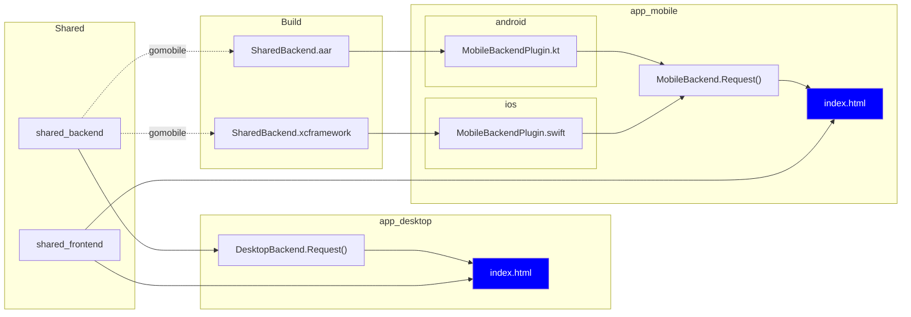

# Outline Connectivity App

## Overview

This is a simple cross-platform app to test connectivity to Outline servers, using the Outline SDK. It is built with [Wails](https://wails.app/) and [Capacitor](https://capacitorjs.com/).

### Architecture

The overarching goal of this application is to demonstrate how the Outline SDK enables you to write each line of business logic only once across all platforms.

We achieve this by first writing a [`shared_backend`](./shared_backend) package in Go - which contains the UDP/TCP connectivity test implemented with the Outline SDK - and a [`shared_frontend`](./shared_frontend/) GUI built with TypeScript and Lit which contains an HTML form for entering the required connectivity test parameters.

Each platform used - [Wails](https://wails.app/) for desktop and [Capacitor](https://capacitorjs.com/) for mobile - then has a thin wrapper around the shared code that handles the platform-specific details. The following diagram illustrates how the shared code is built and used across platforms:



For Mobile, we use `gomobile` to build the `shared_backend` package into a `xcframework` for iOS and an `aar` for Android. You can see this for yourself by running `yarn shared_backend build`. For Desktop, Wails simply refers to the `shared_backend` package directly.

Then we implement a small piece of middleware that enables the frontend to make requests to the backend via the given platform.

```ts
interface Backend {
  Request<T, K>(resourceName: string, parameters: T): Promise<K>
}
```

In a `Request` call, the frontend passes a `resourceName` and `parameters` to the backend, and the backend returns a promise either containing the result or which throws an error. The `resource` is the name of a function in the `shared_backend` package, and the `parameters` are are passed to that function.

With this middleware implemented, we can now use the shared code in the frontend. For example, in the mobile app, we can use the shared code like so:

```ts
@customElement("app-main")
export class AppMain extends LitElement {
  render() {
    return html`<connectivity-test-page 
      .onSubmit=${
        (parameters: SharedFrontend.ConnectivityTestRequest) =>
          MobileBackend.Request<SharedFrontend.ConnectivityTestRequest, SharedFrontend.ConnectivityTestResponse>("ConnectivityTest", parameters)
      } />`;
  }
}
```

## Development

### Prerequisites

- Javascript
  - [Node.js](https://nodejs.org/)
  - [Yarn](https://yarnpkg.com/)
- Golang
  - [Go](https://golang.org/)
  - [Wails](https://wails.app/)
  - [Gomobile](../../mobileproxy/README.md#build-the-ios-and-android-libraries-with-gomobile-bind)
- Apple
  - [Xcode](https://developer.apple.com/xcode/)
  - [CocoaPods](https://cocoapods.org/)
- Android
  - [Android SDK](https://developer.android.com/studio)
  - [Android NDK](https://developer.android.com/ndk)

### Setting up this project

1. Clone this repo
1. `cd` into the repo
1. `yarn setup`
1. if vscode: `yarn setup:vscode`

If at any point you run into issues during development, try `yarn reset`.

### Development Server

`yarn watch`

If you just want to develop ios or android, you can run `yarn watch:ios` or `yarn watch:android` respectively.

### Build

> TODO: how to generate credentials

`yarn build`

### Needed Improvements

1. **\[P1\]** read browser language on load, centralize language list, and only localize once
1. **\[P1\]** documentation on how to generate mobile app build credentials
1. **\[P1\]** add individual test result errors to the test result output UI
1. **\[P2\]** use x/config to parse the access key and showcase the different transports (see: https://github.com/Jigsaw-Code/outline-sdk/blob/main/x/examples/test-connectivity/main.go)
1. **\[P2\]** generalize request handler via generics/reflection
1. **\[P2\]** create a logo for the app
1. **\[P2\]** android-specific toggle CSS
1. **\[P2\]** make backend request calls non-blocking
1. **\[P2\]** introducing some kind of tracing into the test

### Current Issues

1. **\[P1\]** Results dialog isn't rendering as intended (likely because of the `{ all: initial }`)
1. **\[P2\]** `cap ___ run` breaks (have workaround and [issue filed](https://github.com/ionic-team/capacitor/issues/6791))
1. <span style="color:gray">**\[P3\]** spurious lit localize TS error</span>
