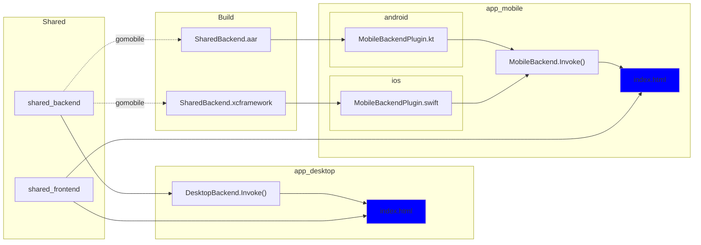

# Outline Connectivity App

## Overview

This is a simple cross-platform app to test connectivity to Outline servers, using the Outline SDK. It is built with [Wails](https://wails.app/) and [Capacitor](https://capacitorjs.com/).

### Architecture

The overarching goal of this application is to demonstrate how the Outline SDK enables you to write each line of business logic only once across all platforms.

We achieve this by first writing a [`shared_backend`](./shared_backend) package in Go - which contains the UDP/TCP connectivity test implemented with the Outline SDK - and a [`shared_frontend`](./shared_frontend/) GUI built with TypeScript and Lit which contains an HTML form for entering the required connectivity test parameters.

Each platform used - [Wails](https://wails.app/) for desktop and [Capacitor](https://capacitorjs.com/) for mobile - then has a thin wrapper around the shared code that handles the platform-specific details.



For Mobile, we use `gomobile` to build the `shared_backend` package into a `xcframework` for iOS and an `aar` for Android. You can see this for yourself by running `yarn shared_backend build`. For Desktop, Wails simply refers to the `shared_backend` package directly.

Then we implement a small piece of middleware called `Invokable` that enables the frontend to speak to the backend via the given platform.

```ts
interface Invokable {
  Invoke(parameters: { method: string; input: string; }): Promise<{ result: string; errors: string[] }>
}
```

In an `Invoke` call, the frontend passes a `method` and `input` to the backend, and the backend returns a `result` and `errors`. The `method` is the name of a function in the `shared_backend` package, and the `input` is a JSON string that is passed to that function. The `result` is a JSON string returned by the function, and the `errors` are any errors that occurred during the function call.

With this simple Invokable binding to whatever native backend the frontend is running on, we can then build the frontend convenience bindings with typing and examples, like so:

```ts
@customElement("app-main")
export class AppMain extends LitElement {
  backend = SharedBackend.from(MobileBackend)

  render() {
    // this.backend.connectivityTest's input is a ConnectivityTestParameters interface, output is a ConnectivityTestResult[]
    return html`<connectivity-test-page .onSubmit=${this.backend.connectivityTest} />`;
  }
}
```


## Development

### Prerequisites

- [Node.js](https://nodejs.org/)
- [Yarn](https://yarnpkg.com/)
- [Go](https://golang.org/)
- [Wails](https://wails.app/)
- [Capacitor](https://capacitorjs.com/)
- [CocoaPods](https://cocoapods.org/)
- [Xcode](https://developer.apple.com/xcode/)
- [Android SDK](https://developer.android.com/studio)
- [Android NDK](https://developer.android.com/ndk)

### Setup

1. Clone this repo
1. `cd` into the repo
1. if using xcode, copy the `settings.example.json` to `settings.json` if it looks good to you
1. `yarn`

If at any point you run into issues during development, try `yarn reset`.

### Development Server

`yarn watch`

### Build

> NOTE: You will need credentials to build for iOS and Android. Talk to @jigsaw.

`yarn build`

### Needed Improvements

1. **\[P1\]** android (in progress)
1. **\[P1\]** read browser language on load (and only localize once)

### Current Issues

1. <span style="color:red">**\[P0\]** add server url to an ENV var somehow... pretty dumb capacitor...</span>
1. **\[P1\]** Results dialog isn't rendering as intended (likely because of the `{ all: initial }`)
1. **\[P2\]** `cap ___ run` breaks (have workaround and [issue filed](https://github.com/ionic-team/capacitor/issues/6791))
1. **\[P2\]** Create a logo for the app
1. **\[P2\]** Introducing some kind of tracing into the test
1. <span style="color:gray">**\[P3\]** spurious lit localize TS error</span>
