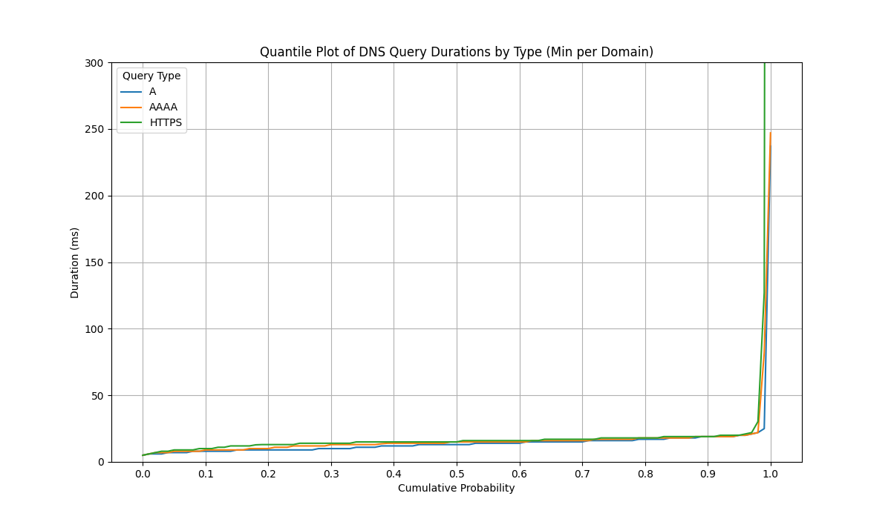
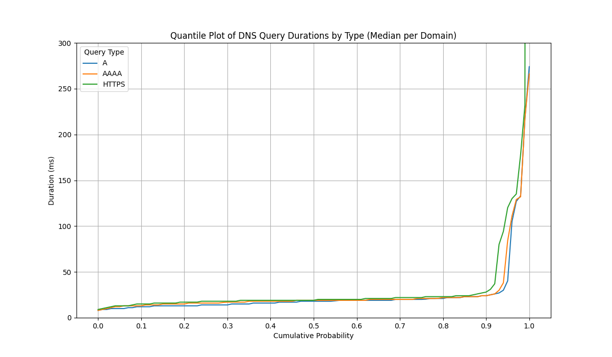

# Performance Analysis of HTTPS Resource Records for ECH Implementations

**Date:** 2025-10-29

**Author:** [Vinicius Fortuna](https://github.com/fortuna)

## 1. Executive Summary

This report analyzes the performance characteristics of DNS HTTPS resource records (RRs) to inform the implementation strategy for Encrypted ClientHello (ECH) on various libraries and platforms. Our analysis of the top 1,000 domains from the Tranco list, based on five separate runs to ensure robustness, reveals that while the majority of HTTPS queries are performant, a significant minority of domains exhibit high latency. Further analysis of minimum and median durations per domain suggests that caching plays a role in mitigating some of the observed latency, but a long tail of slow queries persists, which could negatively impact user experience if the system strictly waits for the HTTPS RR.

**Key Findings:**

*   **Majority of queries are fast:** The median latency for HTTPS queries is low and comparable to A and AAAA records.
*   **A long tail of slow queries:** A small percentage of HTTPS queries are significantly slower, with some taking several seconds or timing out.
*   **Geographic patterns:** Domains with Russian (`.ru`) and Chinese (`.cn`) ccTLDs are disproportionately represented in the set of slow domains.
*   **Minimum durations are less divergent:** When considering the minimum observed HTTPS query duration per domain, the divergence from A/AAAA records is less pronounced, suggesting that caching or initial connection overheads might contribute significantly to the 'long tail' observed in raw and median measurements.

**Recommendation:**

We recommend a hybrid approach for the ECH implementation. Instead of always waiting for the HTTPS RR, the system should race the HTTPS query against the A/AAAA queries with a short timeout (e.g., 50-100ms). If the HTTPS query is not resolved within the timeout, the system should proceed with the standard TLS handshake without ECH. This approach balances the security and privacy benefits of ECH with the need for a fast and reliable user experience.

## 2. Introduction

The introduction of the HTTPS resource record is a critical step for the wide-scale deployment of Encrypted ClientHello (ECH). ECH is a new TLS extension that encrypts the ClientHello message, preventing network observers from snooping on the server name indication (SNI) and other sensitive information.

For ECH to work, the client needs to fetch the ECH configuration from the DNS, which is contained in the HTTPS RR. This introduces a potential performance trade-off: should the client always wait for the HTTPS RR, as mandated by the ECH standard, or should it proceed without it if it's too slow, to avoid harming the user experience?

This report analyzes the performance of HTTPS RR queries based on a dataset of the top 1,000 domains from the Tranco list, collected over five separate runs to ensure the robustness of the results. The goal is to provide data-driven recommendations for ECH implementations.

## 3. Performance Analysis of HTTPS Resource Records

### 3.1. Overall Latency Comparison

The following chart shows a quantile plot of the DNS query durations for A, AAAA, and HTTPS records. This chart illustrates the cumulative distribution of query latencies based on the combined raw data from five runs.

To further investigate the latency characteristics, especially considering potential caching effects, we also generated quantile plots based on the minimum and median durations observed for each domain across the five runs.

As we can see, for the vast majority of queries (up to the ~0.85 quantile), the latency of HTTPS queries is very close to that of A and AAAA queries. However, beyond this point, the latency of HTTPS queries starts to increase significantly, forming a long tail of slow queries. The plots based on minimum and median durations per domain provide a clearer view of the inherent performance characteristics, minimizing the impact of individual slow queries within a domain's multiple runs.

### 3.2. Impact of Geographic Location

We analyzed the difference in duration between HTTPS and A queries, broken down by country-code top-level domain (ccTLD). TLDs that are not country-specific are grouped as "other".

This chart reveals a few interesting patterns. While the "other" category, containing gTLDs, has the widest distribution due to major outliers, some ccTLDs also show significant variation. Notably, the `.kz` (Kazakhstan) and `.nz` (New Zealand) ccTLDs show a significantly higher median duration difference compared to other ccTLDs. The `.jp` (Japan) and `.su` (Soviet Union) also have a higher median. While `.ru` (Russia) and `.cn` (China) have a wide distribution of duration differences, their median values are closer to the bulk of other ccTLDs, suggesting that while there are slow domains in those regions, the typical performance is not as poor as the outliers might suggest.

### 3.3. Analysis of Slow Queries

A closer look at the slowest HTTPS queries, particularly those with high minimum durations, reveals specific issues, confirmed by direct queries to authoritative nameservers:

*   **`nih.gov` and `pubmed.ncbi.nlm.nih.gov` (Rank 193 and 500):** Direct queries to their authoritative nameservers (`ns.nih.gov`) resulted in timeouts and unreachable server errors. Additionally, recursive queries for HTTPS records returned a `SERVFAIL` status with an Extended DNS Error (EDE) code 22, indicating "No Reachable Authority" at the `nih.gov` delegation for HTTPS records. This confirms a fundamental lack of HTTPS RR support or responsiveness at the authoritative server level, leading to the observed 3000ms+ timeouts.
*   **`beian.miit.gov.cn` (Rank 214):** This domain is a CNAME to `23a72c571eab6919.cdn.jiashule.com.`. The `dig +trace` shows that the `miit.gov.cn` nameservers provide this CNAME. Direct queries to the authoritative nameserver for the CNAME target (`ns1.cyudun.net`) for HTTPS records resulted in `NOERROR` but with no answer section, indicating the explicit absence of an HTTPS record. The query time for this negative response was 264ms. This confirms that the observed latency is due to the authoritative DNS infrastructure's handling of non-existent HTTPS records for the CNAME target, rather than caching issues at the recursive resolver. The previous `REFUSED` status when querying `ns1.cyudun.net` for `beian.miit.gov.cn` directly was likely due to `ns1.cyudun.net` not being authoritative for the `beian.miit.gov.cn` zone itself, but rather for the CNAME target.
*   **Other domains with high minimum HTTPS durations (e.g., `yahoo.co.jp`, `consultant.ru`, `myfritz.net`, `t-online.de`, `2gis.com`, `nease.net`):** Direct queries to their respective authoritative nameservers for HTTPS records consistently returned `NOERROR` but with no actual HTTPS records in the answer section. Instead, they provided SOA records in the authority section. The query times for these responses ranged from 100-250ms. This indicates that the delay is incurred while the authoritative DNS server processes the request and determines the absence of an HTTPS record. This behavior is inherent to their DNS configuration and not a caching issue with recursive resolvers.
*   **Twenty-four domains had a minimum HTTPS duration <= 24ms but a median HTTPS duration 50ms+ more than the median A duration:** This pattern strongly suggests caching issues at the recursive resolver level, where initial queries are slow but subsequent queries benefit from caching.

### 3.4. Latency vs. Answer Presence

The box plot above compares the duration of HTTPS queries that received an answer against those that did not. Interestingly, the median latency for queries *with* an answer is slightly higher than for those without. However, the distribution for queries with an answer is much tighter, with fewer extreme outliers. This suggests that while there's a small, consistent cost to retrieving the HTTPS record, the major latency issues are more strongly associated with servers that fail to respond correctly to HTTPS queries (i.e., those that don't return an answer).

### 3.5. HTTPS RR Feature Usage

There are **82 unique domains** in our dataset that have an HTTPS RR.

The bar chart and table below show the frequency of different parameters found in the HTTPS RRs that were successfully retrieved, counted by unique domains.

| Parameter | Unique Domains |
|:---|:---|
| Total HTTPS RR Support | 82 |
| alpn | 78 |
| ipv4hint | 60 |
| ipv6hint | 44 |
| ech | 4 |

This analysis shows that:

*   **82 unique domains** have HTTPS RR support.
*   **78 unique domains** use the `alpn` parameter.
*   **60 unique domains** provide an `ipv4hint`.
*   **44 unique domains** provide an `ipv6hint`.
*   **4 unique domains** have an `ech` parameter in their HTTPS RR.

This corrected data gives a much clearer view of the landscape. The number of domains supporting ECH is still small, as expected for a new standard, but it's now accurately represented as a count of unique domains.

## 4. Recommendations for ECH Implementations

Based on our analysis, we recommend a **hybrid approach** for the implementations. A strict implementation that always waits for the HTTPS RR would lead to a poor user experience for a noticeable minority of domains.

Our recommendation is to **race the HTTPS query against the A/AAAA queries with a short timeout**. Here's how it would work:

1.  When a new connection is initiated, the client sends A, AAAA, and HTTPS queries in parallel.
2.  The client waits for a short period (e.g., 50-100ms) for the HTTPS query to complete.
3.  **If the HTTPS query completes within the timeout:** The client uses the ECH configuration from the HTTPS RR to establish an ECH-enabled connection.
4.  **If the HTTPS query does not complete within the timeout:** The client proceeds with the standard TLS handshake using the IP addresses from the A/AAAA records, without ECH.

This approach has several advantages:

*   **Prioritizes user experience:** It avoids long delays for the user when a server has a slow or broken HTTPS RR implementation.
*   **Enables ECH for the majority:** For the vast majority of domains where the HTTPS RR is fast, ECH will be used, providing its security and privacy benefits.
*   **Graceful degradation:** It allows the system to gracefully fall back to standard TLS when ECH is not available or too slow.

## 5. Conclusion

The HTTPS resource record is a critical component for the future of a more private and secure internet with ECH. While our analysis shows that there is a long tail of slow HTTPS queries, and that caching may mitigate some of these delays, these are ultimately caused by a minority of misconfigured or slow servers. By implementing a hybrid approach that races the HTTPS query with a short timeout, the client can reap the benefits of ECH without compromising on user experience.

## 6. Appendix: Slowest Domains by Min HTTPS Duration (5 runs, diff > 50ms)

| Domain | Rank | Median A (ms) | Min HTTPS (ms) | Median HTTPS (ms) | Max HTTPS (ms) | Ratio (HTTPS/A) |
|:---|:---|:---|:---|:---|:---|:---|
| nih.gov | 193 | 14 | 3024 | 5000 | 5000 | 357.14 |
| pubmed.ncbi.nlm.nih.gov | 500 | 8 | 3016 | 3019 | 5000 | 377.38 |
| beian.miit.gov.cn | 214 | 19 | 232 | 247 | 297 | 13.00 |
| yahoo.co.jp | 536 | 15 | 163 | 167 | 168 | 11.13 |
| consultant.ru | 442 | 17 | 131 | 133 | 139 | 7.82 |
| myfritz.net | 254 | 19 | 117 | 120 | 125 | 6.32 |
| t-online.de | 657 | 19 | 116 | 123 | 125 | 6.47 |
| 2gis.com | 617 | 19 | 107 | 138 | 203 | 7.26 |
| nease.net | 376 | 18 | 76 | 103 | 264 | 5.72 |
| pool.ntp.org | 902 | 16 | 24 | 92 | 109 | 5.75 |
| wbbasket.ru | 615 | 16 | 20 | 130 | 132 | 8.12 |
| ks-cdn.com | 869 | 20 | 19 | 235 | 492 | 11.75 |
| vkuser.net | 427 | 21 | 19 | 124 | 135 | 5.90 |
| intel.com | 677 | 16 | 19 | 85 | 87 | 5.31 |
| taobao.com | 546 | 20 | 19 | 108 | 136 | 5.40 |
| cdnvideo.ru | 641 | 20 | 19 | 130 | 135 | 6.50 |
| kaspi.kz | 1000 | 19 | 19 | 183 | 194 | 9.63 |
| rambler.ru | 559 | 20 | 19 | 135 | 144 | 6.75 |
| rakuten.co.jp | 703 | 19 | 18 | 163 | 186 | 8.58 |
| rbc.ru | 883 | 19 | 18 | 129 | 131 | 6.79 |
| wp.pl | 837 | 17 | 17 | 123 | 131 | 7.24 |
| betweendigital.com | 986 | 18 | 17 | 94 | 118 | 5.22 |
| netease.com | 620 | 24 | 17 | 104 | 236 | 4.33 |
| reg.ru | 209 | 17 | 16 | 132 | 288 | 7.76 |
| shifen.com | 238 | 19 | 16 | 243 | 268 | 12.79 |
| mikrotik.com | 299 | 14 | 16 | 127 | 141 | 9.07 |
| jomodns.com | 271 | 15 | 16 | 225 | 307 | 15.00 |
| gandi.net | 86 | 19 | 15 | 100 | 109 | 5.26 |
| chinamobile.com | 777 | 16 | 14 | 255 | 261 | 15.94 |
| samsungapps.com | 781 | 13 | 13 | 214 | 218 | 16.46 |
| uol.com.br | 576 | 13 | 13 | 137 | 143 | 10.54 |
| mediatek.com | 494 | 18 | 13 | 88 | 195 | 4.89 |
| ksyuncdn.com | 284 | 20 | 13 | 243 | 457 | 12.15 |
